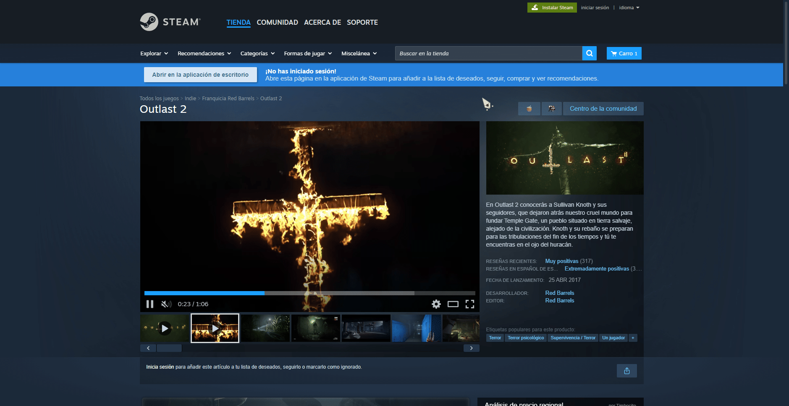
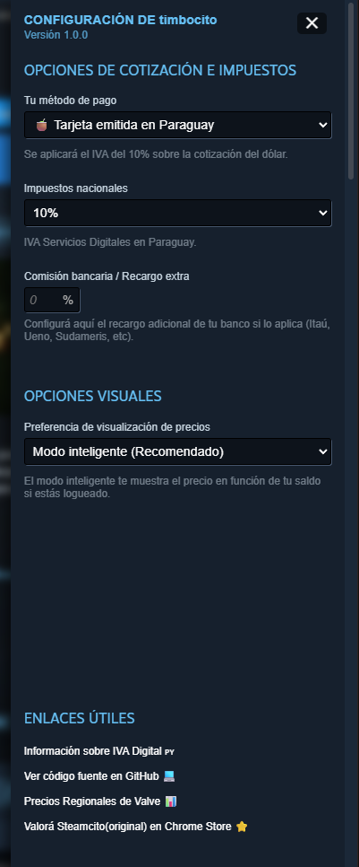
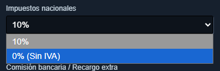
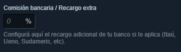
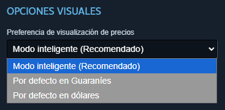
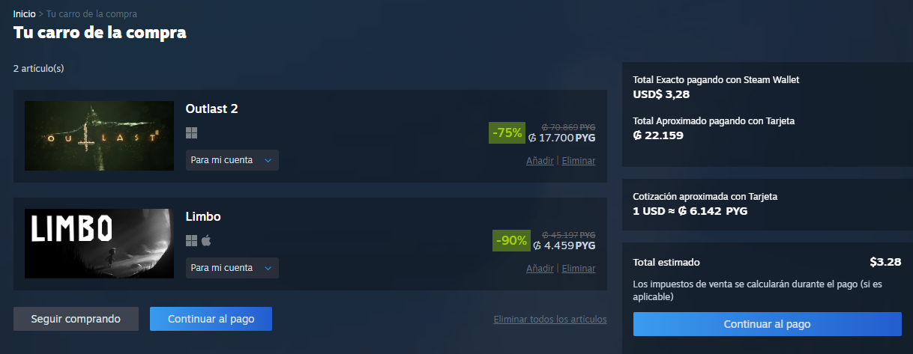

# 🇵🇾 Timbocito Paraguay – Precios en Guaraníes para Steam

**Timbocito Paraguay** es un fork de **Steamcito**, adaptado específicamente para usuarios de Paraguay.

La extensión convierte automáticamente los precios de Steam desde **USD a Guaraníes (₲)** e incluye el **IVA del 10% aplicado a servicios digitales**, permitiendo visualizar el costo real de los juegos de forma rápida y transparente.

## Ya disponible en la Chrome Web Store!

---

## 📚 Tabla de Contenidos

* [📖 Acerca de Timbocito Paraguay](#-acerca-de-timbocito-paraguay)
* [✨ Funcionalidades](#-funcionalidades)
* [🎮 Instalación en Steam](#-instalación-en-steam)
* [🌐 Instalación en Navegador](#-instalación-en-navegador)
* [🧉 Cómo utilizar](#-cómo-utilizar)
* [🤝 Créditos](#-créditos)
* [🚧 Estado del Proyecto](#-estado-del-proyecto)

---

# 📖 Acerca de Timbocito Paraguay

Timbocito Paraguay adapta el funcionamiento de Steamcito al mercado paraguayo, realizando conversiones automáticas de precios e incorporando los impuestos correspondientes para mostrar el costo final real de los juegos en Steam.

El objetivo es ofrecer una experiencia más clara, transparente y cómoda para los usuarios paraguayos.

---

## ✨ Funcionalidades

* 💰 Conversión automática de precios a **Guaraníes (₲)**.
* 📈 Cotización del dólar actualizada automáticamente.
* 🧾 Inclusión del **IVA del 10%** para servicios digitales en Paraguay.
* 🔄 Actualización periódica de cotizaciones e impuestos.
* 📊 Análisis de precios según la sugerencia regional de Valve:

  * 🟢 Barato
  * 🟡 Adecuado
  * 🔴 Caro
* 🎮 Cálculo inteligente considerando tu saldo de **Steam Wallet**.

---

## 🤝 Créditos

Este proyecto está basado en **Steamcito**, desarrollado originalmente por **Emiliano G.**

Timbocito Paraguay adapta su funcionamiento y cálculos para ajustarse al mercado y la divisa paraguaya.

🔗 Proyecto original:

https://github.com/emilianog94/Steamcito-Precios-Steam-Argentina-Impuestos-Incluidos

---

# 🎮 Instalación en Steam
## Metodo 1 (Recomendado)

## Metodo 2
## 1. Descargar el archivo `.crx`

Descarga la última versión:

[Click aquí!](https://github.com/ssaniefrancc/timbocito-steam-impuestos-incluidos/releases/latest/download/timbocito.crx)

---

## 2. Abrir Steam en una pestaña del navegador

En la tienda de Steam, haz clic derecho sobre el banner principal y selecciona:

**"Open link in new tab / Abrir en una nueva pestaña"**

---

## 3. Abrir extensiones de Chrome

En la barra de búsqueda escribe:

`chrome://extensions`

y presiona **Enter**.

---

## 4. Instalar la extensión

Activa el **Modo Desarrollador** y arrastra el archivo `.crx` descargado anteriormente.

---

# 🌐 Instalación en Navegador

> También puede instalarse mediante código fuente, útil en caso de que el archivo `.crx` no funcione por algún motivo.

## 1. Descargar el código fuente

Descarga la última versión del proyecto:

[Click aquí!](https://github.com/ssaniefrancc/timbocito-steam-impuestos-incluidos/archive/refs/heads/main.zip)

---

## 2. Abrir extensiones del navegador

---

## 3. Activar el Modo Desarrollador

---

## 4. Cargar la extensión

Haz clic en:

**"Load unpacked / Cargar extensión sin empaquetar"**

Luego selecciona la carpeta:

`chrome_extension`

del código fuente descargado y presiona **Aceptar**.

---

# 🧉 Cómo utilizar

Timbocito funciona de manera similar a Steamcito.

Puedes hacer clic sobre los precios para alternar entre **USD y Guaraníes**.

---

Al ingresar a la página de un juego, aparecerá el botón del **🧉**, desde donde podrás abrir el menú y configurar distintas opciones.

---

### 💸 Mostrar precio con o sin IVA

Puedes alternar entre visualizar el precio **con IVA o sin IVA**, según tu preferencia.

---

### 🏦 Agregar recargos extra del banco

Si tu banco aplica una comisión adicional por transacción internacional, puedes agregar ese porcentaje en el campo de **Recargos Extras**.

---

### 💱 Elegir divisa predeterminada

Puedes seleccionar la divisa que deseas ver por defecto:

* USD
* PYG
* 🧠 **Modo Inteligente (Recomendado)**

Este último mostrará el precio según tu saldo disponible si estás conectado a Steam.

---

### 🛒 Visualización en el carrito

Al agregar juegos al carrito, se mostrará el **total en Guaraníes con impuestos incluidos**, según la configuración seleccionada.

---

## 🚧 Estado del Proyecto

Timbocito Paraguay sigue en desarrollo, cualquier error o bug favor reportarlo :).
