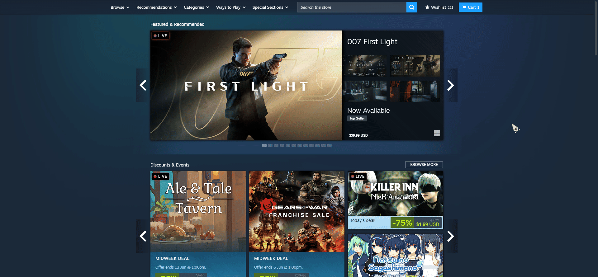
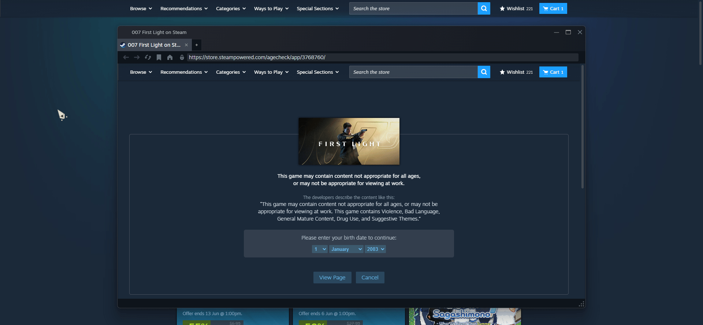
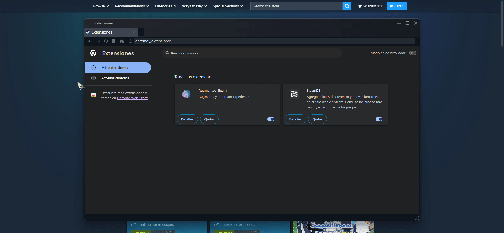
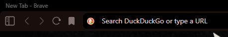
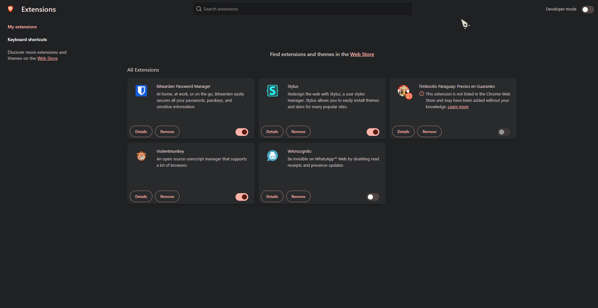
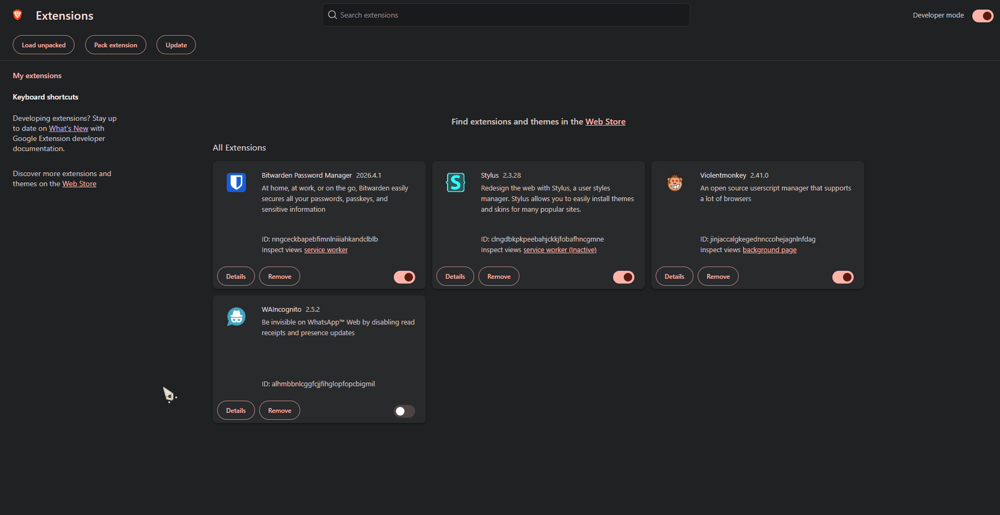

# 🇵🇾 Timbocito Paraguay – Precios en Guaraníes para Steam

Timbocito Paraguay es un **fork de Steamcito**, adaptado específicamente para usuarios de Paraguay.

La extensión convierte automáticamente los precios de Steam desde USD a **Guaraníes (₲)** e incluye el **IVA del 10% aplicado a servicios digitales**, permitiendo visualizar el costo real de los juegos de forma rápida y transparente.

> Actualmente no está publicado en Chrome Web Store, pero voy a subirlo proximamente.

---

## 📚 Tabla de Contenidos

* [Acerca de Timbocito Paraguay](#-acerca-de-timbocito-paraguay)
* [Créditos](#-créditos)
* [Funcionalidades](#-funcionalidades)
* [Instalación en Navegador](#-instalación-en-navegador)
* [Instalación en Steam](#-instalación-en-steam)

---

## 🤝 Créditos

Este proyecto está basado en **Steamcito**, desarrollado originalmente por Emiliano G.

Timbocito Paraguay adapta su funcionamiento y cálculos para ajustarse al mercado y la divisa paraguaya.

Proyecto original:

https://github.com/emilianog94/Steamcito-Precios-Steam-Argentina-Impuestos-Incluidos

---

## ✨ Funcionalidades

* 💰 Conversión automática de precios a **Guaraníes (₲)**.
* 📈 Cotización del dólar actualizada automáticamente.
* 🧾 Inclusión del **IVA del 10%** para servicios digitales en Paraguay.
* 🔄 Actualización periódica de cotizaciones e impuestos.
* 📊 Análisis de precios según la sugerencia regional de Valve:

  * 🟢 Barato
  * 🟡 Adecuado
  * 🔴 Caro
* 🎮 Cálculo inteligente considerando tu saldo de **Steam Wallet**.

---

# 🎮 Instalación en Steam

### 1. Descargar el archivo `.crx`

Descarga la última versión:

https://github.com/ssaniefrancc/timbocito-steam-impuestos-incluidos/releases/download/1.0.0/Timbocito.-.Steam.Paraguay.crx

### 2. Abrir Steam en una pestaña del navegador

En la tienda de Steam, haz clic derecho sobre el banner principal y selecciona:

**"Open link in new tab / Abrir en una nueva pestaña"**

### 3. Abrir extensiones de Chrome

En la barra de búsqueda escribe:

`chrome://extensions`

y presiona Enter.

### 4. Instalar la extensión

Activa el **modo desarrollador** y arrastra el archivo `.crx` descargado anteriormente.

---

# 🌐 Instalación en Navegador
> Tambien se puede instalar de la misma manera que la anterior forma pero esta en caso de que no les funcione por a o b motivo
### 1. Descargar el código fuente

Descarga la última versión del proyecto:

https://github.com/ssaniefrancc/timbocito-steam-impuestos-incluidos/archive/refs/tags/1.0.0.zip

### 2. Abrir extensiones del navegador

### 3. Activar el modo desarrollador

### 4. Cargar la extensión

Haz clic en **"Load unpacked / Cargar extensión sin empaquetar"**, selecciona la carpeta `chrome_extension` del código fuente descargado y presiona **Aceptar**.

---

## 🚧 Estado del Proyecto

Timbocito Paraguay sigue en desarrollo, cualquier error o bug favor reportarlo :).
